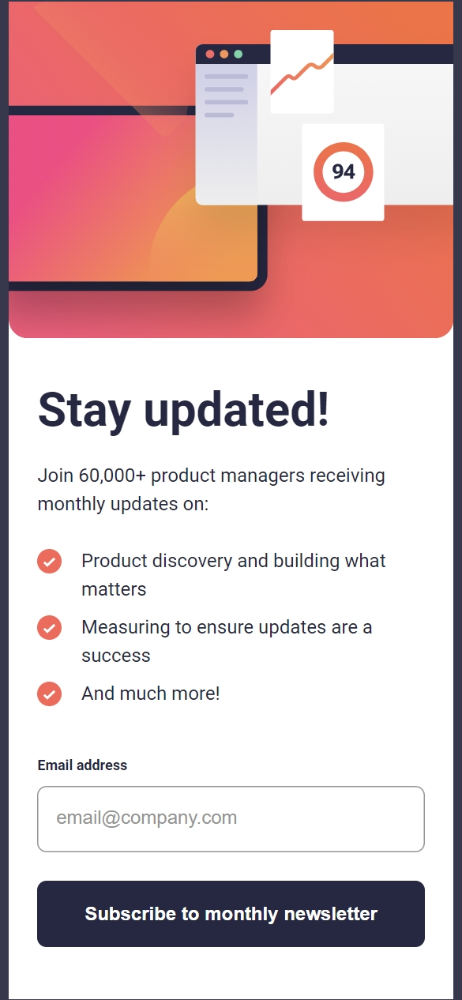
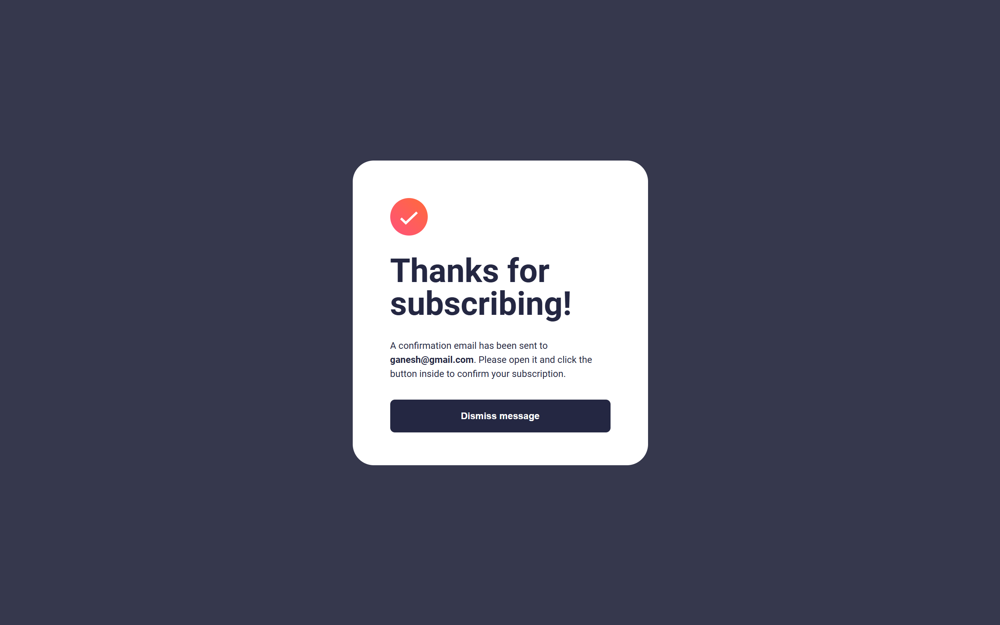

# Frontend Mentor - Newsletter sign-up form with success message solution

This is a solution to the [Newsletter sign-up form with success message challenge on Frontend Mentor](https://www.frontendmentor.io/challenges/newsletter-signup-form-with-success-message-3FC1AZbNrv). Frontend Mentor challenges help you improve your coding skills by building realistic projects. 

## Table of contents

- [Overview](#overview)
  - [The challenge](#the-challenge)
  - [Screenshot](#screenshot)
  - [Links](#links)
- [My process](#my-process)
  - [Built with](#built-with)
  - [What I learned](#what-i-learned)
  - [Continued development](#continued-development)
  - [Useful resources](#useful-resources)
- [Author](#author)


## Overview

### The challenge

Users should be able to:

- Add their email and submit the form
- See a success message with their email after successfully submitting the form
- See form validation messages if:
  - The field is left empty
  - The email address is not formatted correctly
- View the optimal layout for the interface depending on their device's screen size
- See hover and focus states for all interactive elements on the page

### Screenshot







Alternatively, you can use a tool like [FireShot](https://getfireshot.com/) to take the screenshot. FireShot has a free option, so you don't need to purchase it. 

### Links

- Solution URL: [https://github.com/ganeshreddychimmula/newsletter-sign-up.git](https://github.com/ganeshreddychimmula/newsletter-sign-up.git)
- Live Site URL: [https://ganeshreddychimmula.github.io/newsletter-sign-up/](https://ganeshreddychimmula.github.io/newsletter-sign-up/)

## My process

### Built with

- Semantic HTML5 markup
- CSS custom properties
- Flexbox
- CSS Grid
- Mobile-first workflow

### What I learned

### Email validation Regex string
```js
const regex = /^[^\s@]+@[^\s@]+\.[^\s@]+$/;
```
Explanation of the regex:
- ^ — matches the start of the string.

- [^\s@]+ — ensures at least one character that is not whitespace or an @.

- @ — matches the @ symbol exactly once.

- [^\s@]+ — ensures domain contains at least one character.

- \. — matches a literal period (.).

- [^\s@]+ — ensures domain extension contains at least one character.

- $ — matches the end of the string.

The regex component [^\s@]+ can be broken down as follows:

- [...] (Character Class): This part tells the regex engine that it should match any one character listed inside the brackets.

- ^ (Negation): When placed at the beginning of a character class, the caret (^) negates the set. This means "match any character that is NOT in the following list."

- \s (Whitespace): This matches any whitespace character (spaces, tabs, line breaks, etc.).

- @ (Literal Character): This matches the literal "@" symbol.

- + (Quantifier): The plus sign indicates "one or more" occurrences of the preceding element. In this case, it means one or more characters that are not whitespace or "@".

If you want more help with writing markdown, we'd recommend checking out [The Markdown Guide](https://www.markdownguide.org/) to learn more.


### Useful resources

- [https://buildexcellentwebsit.es/](https://buildexcellentwebsit.es/) - This helped me for XYZ reason. I really liked this pattern and will use it going forward.
- [https://every-layout.dev/](https://every-layout.dev/) - This is an amazing article which helped me finally understand XYZ. I'd recommend it to anyone still learning this concept.


## Author

- Frontend Mentor - [@ganeshreddychimmula](https://www.frontendmentor.io/profile/ganeshreddychimmula)
